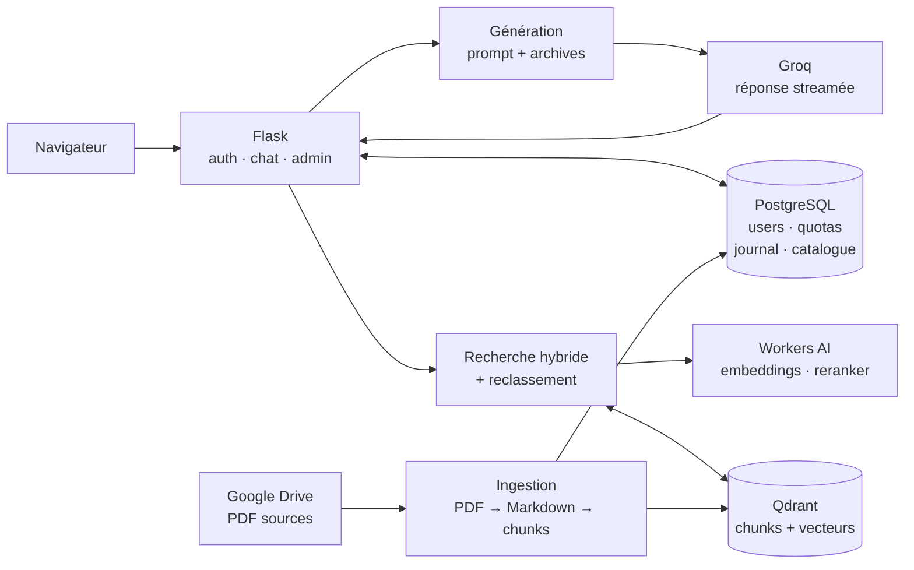

<div align="center">


# TN-GPT

**L'assistant de la vie étudiante de TELECOM Nancy.**

Un RAG qui répond sur les archives de l'école — et qui parle comme un pote de promo, pas comme un service client.

</div>

---

## Ce que c'est

TN-GPT retrouve l'info dans les archives de TELECOM Nancy (comptes rendus, plannings, mails d'assos, lore du Mini Tel') et répond en s'appuyant **uniquement** sur elles : pas de connaissance propre, donc pas d'invention sur un corpus que personne ne peut vérifier.

Ce qu'il y a dedans :

- **Chat en streaming**, adossé à une recherche hybride dans Qdrant puis à un reclassement Workers AI.
- **Carte des mers** — les clubs et assos dessinés en carte au trésor quand la question s'y prête.
- **Panel admin** — catalogue de documents, permissions par bitmask, quotas journaliers, pool de clés Groq.
- **Challenges CTF** — trois épreuves de prompt injection servies à côté du chat normal.

L'accès est restreint aux comptes `@telecomnancy.net` via OAuth Google.

## Démarrage rapide

Prérequis : [uv](https://docs.astral.sh/uv/), [Docker](https://docs.docker.com/get-docker/), une instance Qdrant, un projet Google Cloud (OAuth) et une clé [Groq](https://console.groq.com/).

```bash
git clone <url-du-repo> && cd tn-gpt
uv sync

cp env.example .env          # puis remplis les valeurs (voir le guide d'installation)
docker compose up -d db      # PostgreSQL
uv run flask db upgrade      # schéma

uv run python main.py
```

L'application écoute sur http://localhost:8501. Connecte-toi une première fois, puis élève ton compte :

```bash
uv run flask make-admin ton.adresse@telecomnancy.net
```

Le détail des variables d'environnement, de la configuration OAuth et de l'ingestion Drive est dans [docs/installation.md](docs/installation.md).

## Architecture

PostgreSQL est le **plan de contrôle** (utilisateurs, quotas, journal d'usage, catalogue) ; Qdrant est le **plan de données** (les chunks et leurs vecteurs).



Le détail des composants, le trajet complet d'une question et la chaîne d'ingestion sont dans [docs/architecture.md](docs/architecture.md).

## Contribuer

Avant de commit, rejoue la CI en local — lint, complexité, docstrings, secrets, audit de dépendances et tests :

```bash
./ci_local.sh
```

Le projet est formaté avec [Ruff](https://docs.astral.sh/ruff/) ; active `source.fixAll.ruff` et `source.organizeImports.ruff` à la sauvegarde dans ton éditeur.

---

<div align="center">
Fait par <a href="https://neuratn.ath0ms.fr">Neura'TN</a>.
</div>
