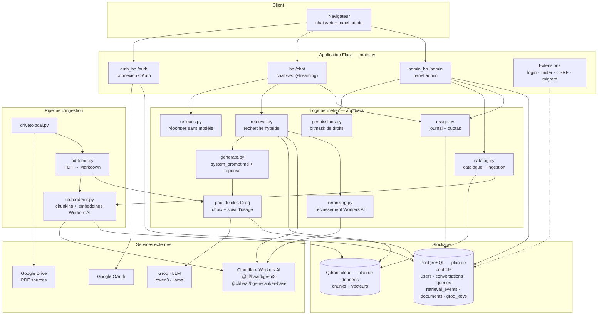
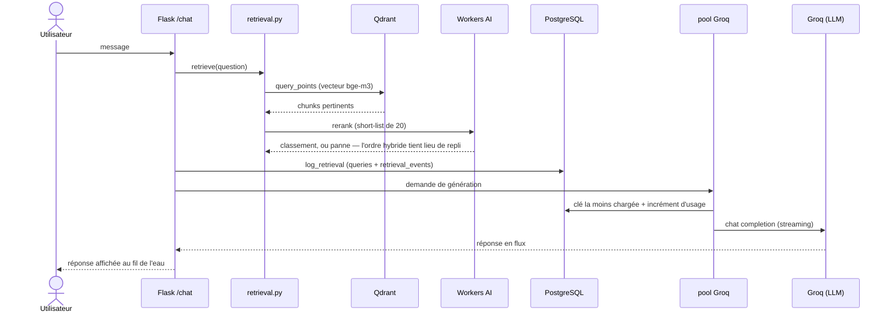
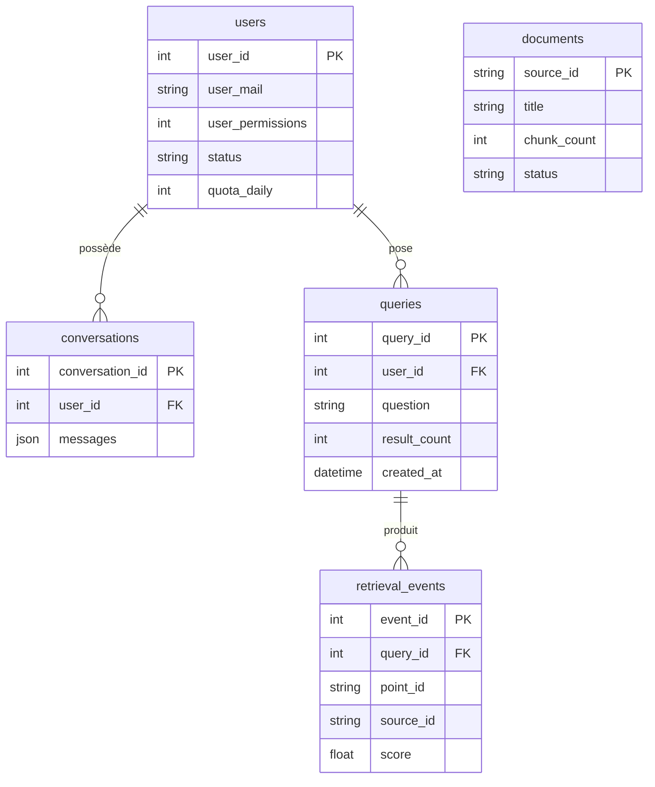

# Architecture de TN-GPT

Vue d'ensemble technique du projet : les composants, le trajet d'une question,
et la chaîne d'ingestion des documents.

Le principe qui structure tout : **PostgreSQL est le plan de contrôle**
(utilisateurs, journal d'usage, quotas, catalogue), **Qdrant est le plan de
données** (les chunks et leurs vecteurs). Qdrant n'enregistre aucun usage : tout
le monitoring vient du journal en base.

> **Architecture cible.** Ce document intègre deux évolutions en cours : le
> retrait de l'accès API entrant (TN-GPT n'est pas exposé en tant qu'API) et
> l'ajout d'un **pool de clés Groq** réparti pour éviter qu'une seule clé sature.

## Composants et flux

Le pool de clés Groq est traversé aux **deux** endroits où le projet appelle
Groq : la génération des réponses ([generate.py](../app/back/generate.py)) et
l'extraction de métadonnées pendant l'ingestion
([pdftomd.py](../app/back/pdftomd.py)).

## Trajet d'une question (chat web)

La recherche et la journalisation ont lieu **avant** le streaming : l'usage est
enregistré même si le client se déconnecte pendant la réponse.

Certaines questions n'atteignent jamais ce trajet. Les réponses réflexes
([reflexes.py](../app/back/reflexes.py)) — la lettre suivante de l'alphabet,
« feur », « gorge » — sont résolues dans la route, avant Qdrant et avant Groq :
leur réponse est connue d'avance, elle ne vaut ni une recherche ni une
complétion.

## Le prompt

Le prompt système est un fichier, `app/back/system_prompt.md`, et non une
constante Python : c'est de la prose qu'on relit et qu'on révise comme de la
documentation. Il est lu une fois à l'import et ne varie jamais d'une requête
à l'autre.

Le partage entre les messages envoyés à Groq est strict :

| Message | Contenu | Varie |
|---|---|---|
| `system` | les règles, en sections `<mission>`, `<perimetre>`, `<ancrage_factuel>`, `<hierarchie_des_sources>`, `<ton_et_format>`, `<conversation>` | jamais |
| tours passés | les `HISTORY_CONTEXT_SIZE` derniers messages de la conversation, relus en base, tronqués à 500 caractères chacun | à chaque requête |
| `user` | `<contexte_execution>` (date, prénom), `<archives>` (fiches SQL + chunks Qdrant), `<question>` | à chaque requête |

La mémoire est celle d'**une** conversation : l'historique vient de la ligne
`conversations` visée, jamais des autres. Les tours passés partent sans leurs
archives — elles ne sont plus disponibles — ce qui fait du fil de l'échange un
souvenir et non un second corpus, et le prompt système le dit au modèle. La
carte au trésor ne les reçoit pas : c'est un coup unique.

Le même historique sert déjà, en amont, à enrichir la requête Qdrant
(`_enrich_query`) : une question de suite ramène les bons chunks *et* se lit
dans son fil.

Rien de ce qui vient de Qdrant n'atterrit du côté des règles. Les archives sont
des documents ingérés automatiquement, donc du texte que personne ne relit : les
isoler dans le message utilisateur est ce qui permet au prompt système de poser
qu'un ordre trouvé dans une archive est du texte à citer, pas une consigne à
suivre.

Un `CallSpec` ([generate.py](../app/back/generate.py)) réunit le message
système, le constructeur de prompt, les paramètres Groq, la lecture de la
complétion et la température. La carte au trésor a le sien : elle garde ses
règles dans son message utilisateur, parce qu'un prompt qui décrit un chat en
prose n'a aucun sens pour un appel d'outil.

## Pipeline d'ingestion

Deux entrées alimentent la même chaîne : la pipeline automatique depuis Google
Drive, et le dépôt manuel par glisser-déposer dans le panel admin.

## Schéma de la base (plan de contrôle)

La table `groq_keys` (pool de clés et compteurs d'usage) rejoindra ce schéma
avec la fonctionnalité de répartition Groq.
