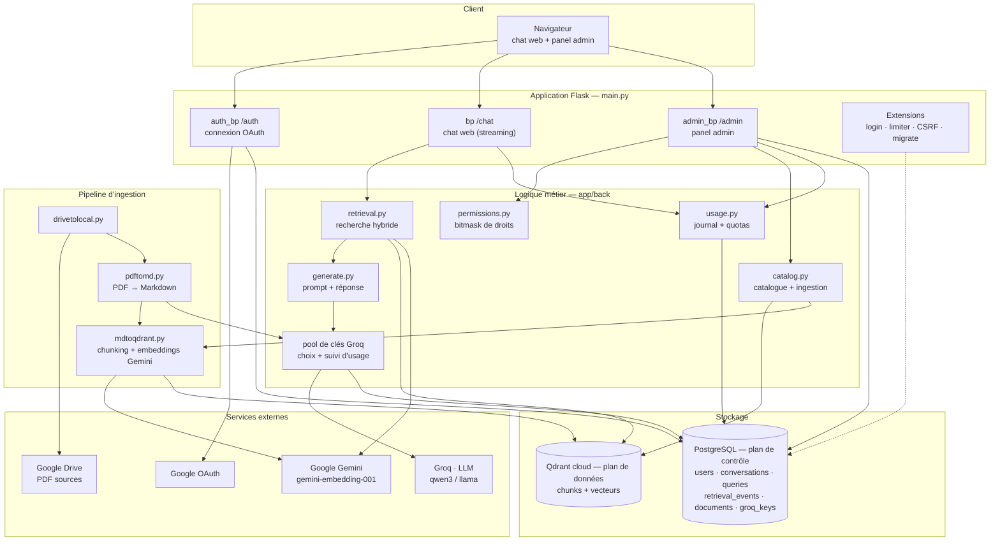
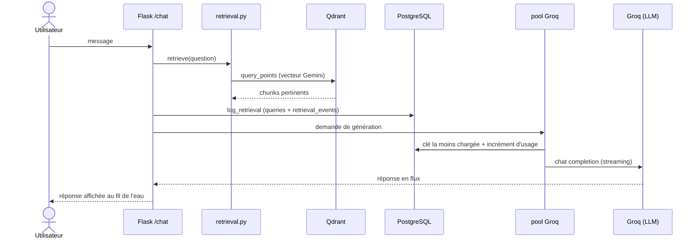
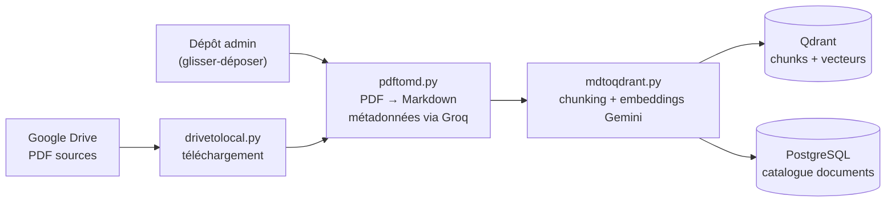
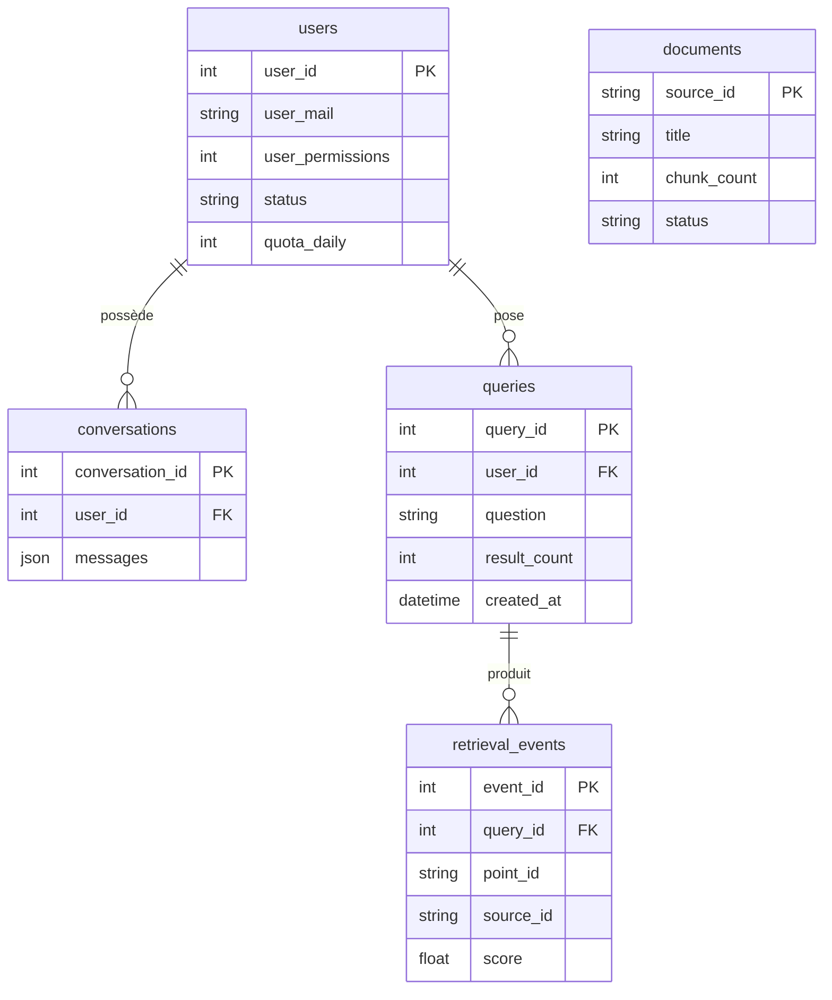

# Architecture de TN-GPT

Vue d'ensemble technique du projet : les composants, le trajet d'une question,
et la chaîne d'ingestion des documents.

Le principe qui structure tout : **PostgreSQL est le plan de contrôle**
(utilisateurs, journal d'usage, quotas, catalogue), **Qdrant est le plan de
données** (les chunks et leurs vecteurs). Qdrant n'enregistre aucun usage : tout
le monitoring vient du journal en base.

> **Architecture cible.** Ce document intègre deux évolutions en cours : le
> retrait de l'accès API entrant (TN-GPT n'est pas exposé en tant qu'API) et
> l'ajout d'un **pool de clés Groq** réparti pour éviter qu'une seule clé sature.

## Composants et flux

Le pool de clés Groq est traversé aux **deux** endroits où le projet appelle
Groq : la génération des réponses ([generate.py](../app/back/generate.py)) et
l'extraction de métadonnées pendant l'ingestion
([pdftomd.py](../app/back/pdftomd.py)).

## Trajet d'une question (chat web)

La recherche et la journalisation ont lieu **avant** le streaming : l'usage est
enregistré même si le client se déconnecte pendant la réponse.

## Pipeline d'ingestion

Deux entrées alimentent la même chaîne : la pipeline automatique depuis Google
Drive, et le dépôt manuel par glisser-déposer dans le panel admin.

## Schéma de la base (plan de contrôle)

La table `groq_keys` (pool de clés et compteurs d'usage) rejoindra ce schéma
avec la fonctionnalité de répartition Groq.
